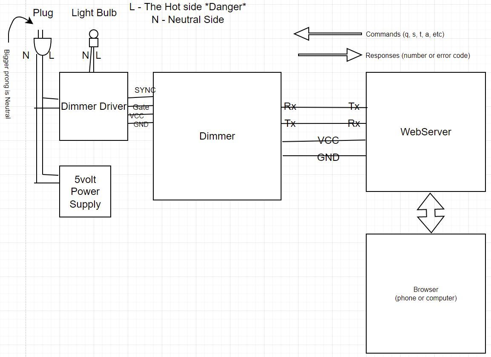

# Sunrise Clock

## Overview

The Sunrise Clock is a device that is similar to an alarm clock, that, using a circadian LED light bulb, when the alarm time is reached, 
gradually turns on the light bulb until it is fully on.  Circadian lights simulate the natural outside sunlight and promotes better sleep
by emiting specific wavelengths that simulate the sun rising in the morning.

An example of a circadian LED light can be found 
on Amazon at: [BIOS Lighting Circadian A19 LED Light Bulb](https://www.amazon.com/gp/product/B08VC71HSG/ref=ppx_yo_dt_b_search_asin_title?ie=UTF8&psc=1)  

## Parts is parts...

The Sunrise Clock has two parts to it, the Sunrise Clock Dimmer and the Sunrise Clock Webserver.

### The Sunrise Clock Dimmer (this repository) 

This is a Spark Fun Pro Micro board (or equivilent), which does the actual dimming. For arduino 
settings, set the board option to *Arduino Leonardo*.  (The Arduino Leonardo has the same processor chip, 
the ATMega-32U4 chip made by Atmel, which is an 8 bit micro with builtin flash and sdram.) 

- 255 dimming levels. 0 - off, 255 fully on  (although the range is rally like 5 to 245)                           
- Default UART speed 9600bps. Can be changed.                         
- The Sunrise Clock Dimmer can keep track of time and trigger the alarm if alarm time is set.
- Alternatively, the webserver can keep track of time and alarm time, then send d command to trigger 
                                                                    
Connections:
```
OPTIONAL SWITCH -> ARDUINO PIN 2 (could be Wifi reset, but not implemented)
DIMMER SYNC -> ARDUINO PIN 3                                        
DIMMER GATE -> ARDUINO PIN 4                                        
PROMICRO RX -> TX to ESP01S RX (signals must be 3.3volt compliant!) 
PROMICRO TX -> RX to ESP01S TX (signals must be 3.3volt compliant!) 
```
The Sunrise Clock Webserver communicates to this board through a serial connection to 
send commands to it:

Commands can come from either the USB serial port or the async serial port. When
they come in through the serial port, they would be coming in from the 
SunriseClockWebserver and should be preceeded with three pound signs ###.  This
is because the webserver will spit out all sorts of things when it is booting, so
we want to absolutely identify when commands start.  When typing in commands
through the USB serial port, the ### is not needed before the command.

### Commands

| Command | Description |
| ------- | ----------- |
| snnn | Set dim level manually |
| o | Turn light fully on |                             
| f | Turn light fully off |                            
| thh:mm:ss | Set current time |                                
| ahh:mm:ss | Set alarm time and turn alarm on | 
| a | Turn off alarm if it is on, or turn on if off |
| c | Cancel alarm if it has been triggered |   
| q | Query current time and alarm time |           
| w | Set wake up time in secs if default not desired. |
| d | Force alarm going off. |
| q | Query a few things (see below) |

For debugging purposes, you can type these commands into Arduino's USB serial monitor.

### Responses: Returned Values or Returned Errors

On the serial port back to the ESP01S (i.e. Serial1), all output responses 
start with "#" and some decimal value:        
                                                                                   
| Command | Response value |
| ------- | -------------- |
| s | Returns current dimmer value 0-255 |                        
| o | Returns current dimmer value, which is maximum value (245) |
| f | Returns current dimmer value, which is minimum value (5) |                   
| a | Returns either 1, 0 or error code. 1 = alarm now set, 0 = alarm disabled |   
| t | Returns either 1 or error code |             
| w | Returns current number of wakeup seconds |                                   
| c | Returns 0 indicating alarm cancelled |                                       
| q | Returns  #hh:mm:ss-hh:mm:ss-ddd-wwwww-b-b-b |

The q command returns the current time, the alarm time, the current dimmer setting,
the current wakeup time in seconds, whether the time is set, whether the alarm 
is set, and if the alarm has been triggered (and is going through it's dimming period).
The values returned from the q command is a string like this:

`#hh:mm:ss-hh:mm:ss-nnn-sssss-b-b-b` 
                                                                                    
If there is an error, then response will be #Ennn  where nnn is an error 
code.  Test for 'E' before trying to scan a decimal value.                        

### The Sunrise Clock Webserver (in the SunriseClockWebserver repository)                   
This is an ESP-01S board. This board has an ESP8266 chip on it and 4 meg of memory. See the 
SunriseClockWebserver repository for more information.

### Sunrise Clock Diagram

